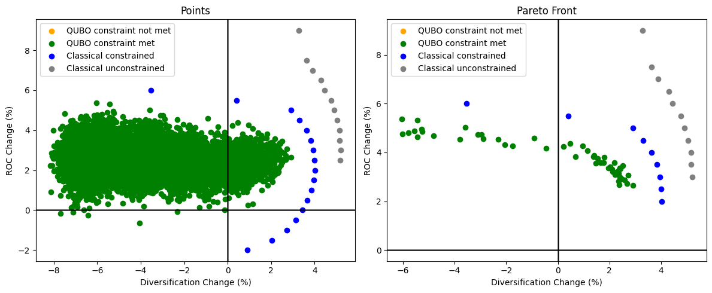
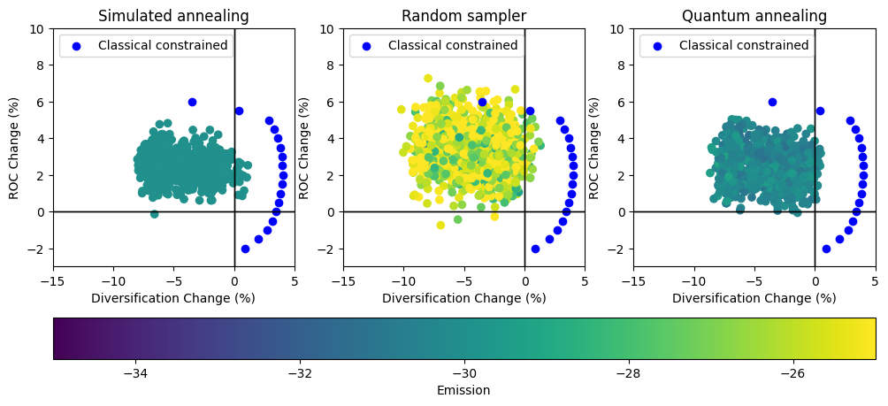
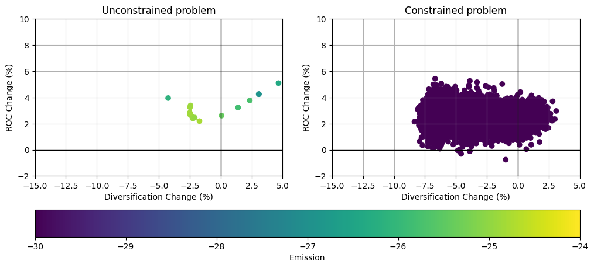
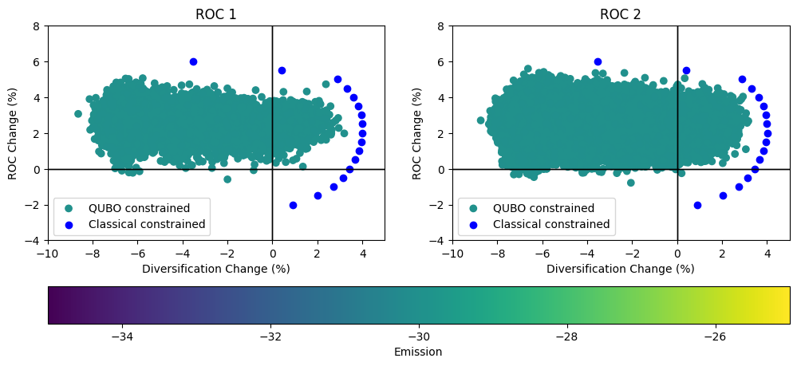

# Examples: Portfolio optimization

This repository contains examples for the `tno.quantum.problems.portfolio_optimization` package, see [TNO Portfolio Optimization](https://github.com/TNO-Quantum/problems.portfolio_optimization).

The `tno.quantum.problems.portfolio_optimization` package provides Python code that converts the multi-objective portfolio optimization problem
into a `QUBO`_ problem. The transformed problem can then be solved using quantum annealing techniques.

The following objectives can be considered

- `return on capital`, indicated by ROC,
- `diversification`, indicated by the `Herfindahl-Hirschman Index`_ HHI.

Additionally, it is possible to add capital growth factor and arbitrary emission reduction constraints.

## Documentation

Documentation of the `tno.quantum.problems.portfolio_optimization` package can be found [here](https://tno-quantum.github.io/problems.portfolio_optimization/).

## Examples

1. [Pareto Front](pareto_front.ipynb): This example demonstrates the basic usage of the `PortfolioOptimizer` and shows how a Pareto front can be plotted for the results.

    

1. [Different Samplers](different_samplers.ipynb): This example demonstrates how different QUBO samplers can be used.

    

1. [Emission constraint](emission_constraint.ipynb): This example demonstrates the impact of using emission constraints.

    

1. [Different ROC formulations](different_roc_formulations.ipynb): This example demonstrates the differences between different ROC formulations.

    