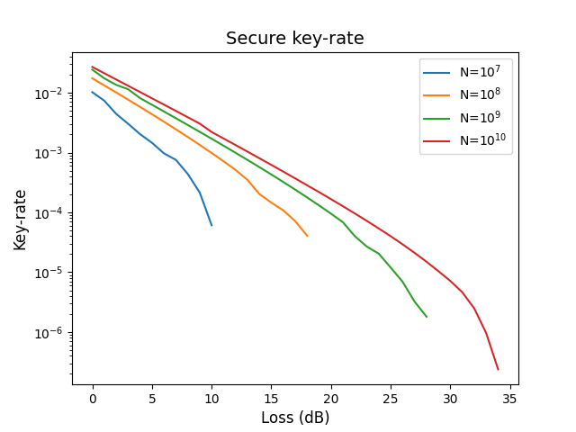
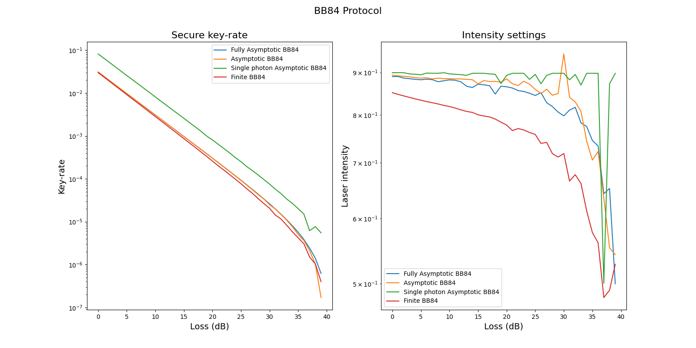

# Examples: Variational classifier

This repository contains examples for the `tno.quantum.communication.qkd_key_rate` package, see [TNO QKD Key-Rate](https://github.com/TNO-Quantum/communication.qkd_key_rate).

The `tno.quantum.communication.qkd_key_rate` package provides python code to compute optimal protocol parameters for different quantum key distribution (QKD) protocols.

The presented code can be used to

- determine optimal parameter settings needed to obtain the maximum key rate, 
- correct errors in exchanged sifted keys for the different QKD protocols,
- apply privacy amplification by calculating secure key using hash function. 

## Documentation

Documentation of the `tno.quantum.communication.qkd_key_rate` package can be found [here](https://tno-quantum.github.io/communication.qkd_key_rate/).

## Examples

1. [Number of pulses](example_number_pulses.py): This example demonstrates how to compute secure key-rate as a function of the number of pulses for the BB84 finite key-rate protocol.

    

1. [BB84 protocol](example_bb84_plot.py): In this example secure key-rate is computed for various BB84 protocols as function of the loss.

    

1. [Basic usage BB84 protocols](example_bb84.py)
1. [Basic usage BB84 single photon protocol](example_bb84_single_photon.py)
1. [Basic usage BBM92 protocols](example_bbm92.py)
1. [Basic usage Cascade protocol](example_cascade.py)
1. [Basic usage Winnow protocol](example_winnow.py)
1. [Basic usage privacy amplification](example_privacy_amplification.py)

