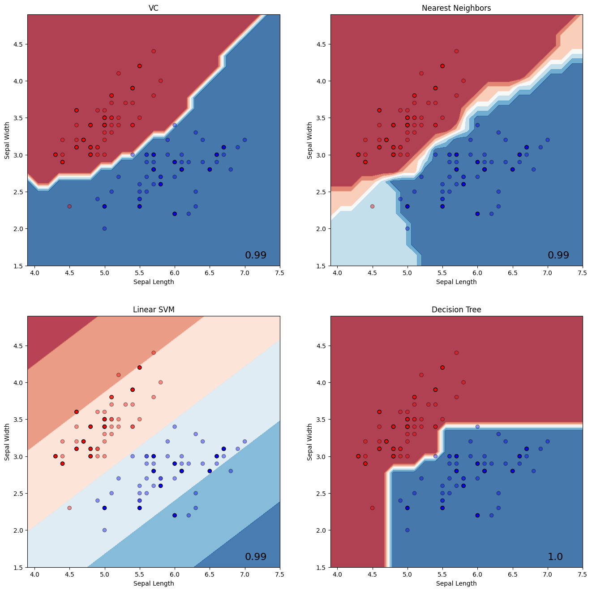
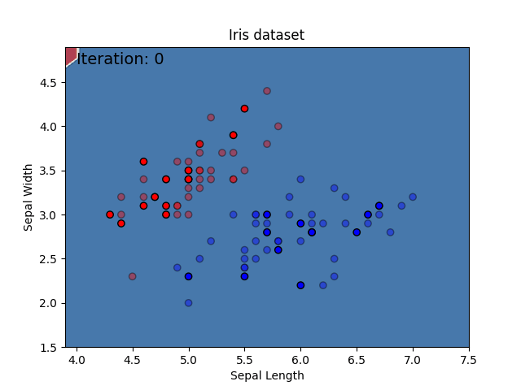
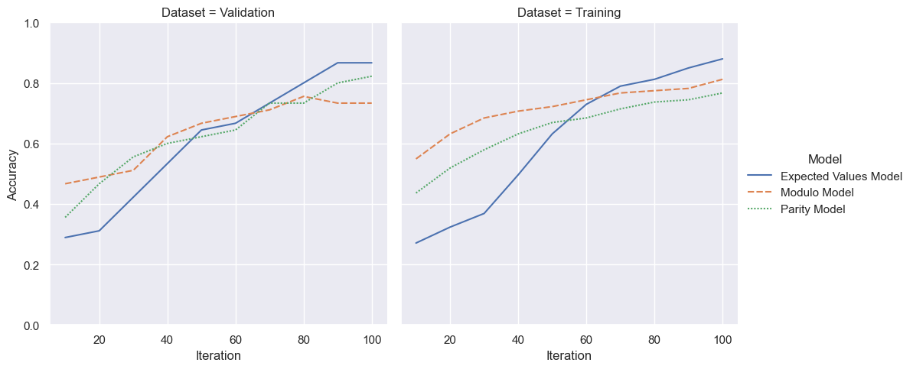

# Examples: Variational classifier

This repository contains examples for the `tno.quantum.ml.classifiers.vc` package, see [TNO Variational Classifier](https://github.com/TNO-Quantum/ml.classifiers.vc).

The `tno.quantum.ml.classifiers.vc` package provides a `VariationalClassifier` class, which has been implemented 
in accordance with the
[scikit-learn estimator API](https://scikit-learn.org/stable/developers/develop.html).
This means that the classifier can be used as any other (binary and multiclass)
scikit-learn classifier and combined with transforms through
[Pipelines](https://scikit-learn.org/stable/modules/generated/sklearn.pipeline.Pipeline.html).
In addition, the `VariationalClassifier` makes use of
[PyTorch](https://pytorch.org/docs/stable/tensors.html) tensors, optimizers, and loss
functions.

## Documentation

Documentation of the `tno.quantum.ml.classifiers.vc` package can be found [here](https://tno-quantum.github.io/ml.classifiers.vc/).

## Examples

1. [Classification](classification.ipynb): This example demonstrates basic classifier usage and demonstrates that the `VariationalClassifier` can be used like any other sklearn classifier.

    

1. [Decision Boundary](decision_boundary.ipynb): This example demonstrates how to compute the decision boundary for different number of iterations during training.

    

1. [Quantum Models](quantum_models.ipynb): This example demonstrates how to use different pre-processing models.

    